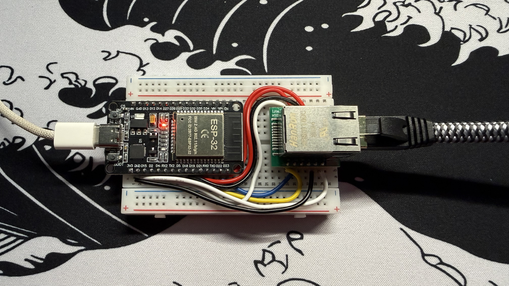
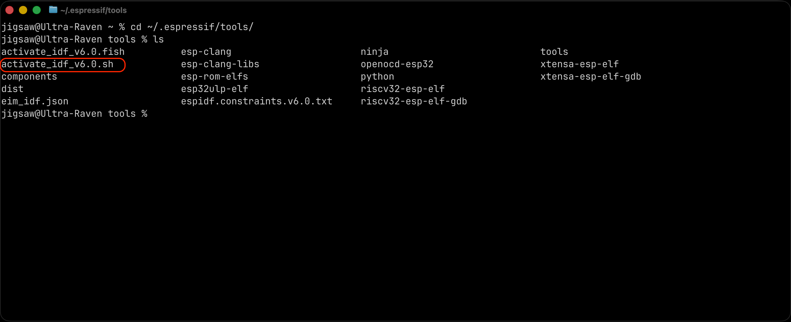
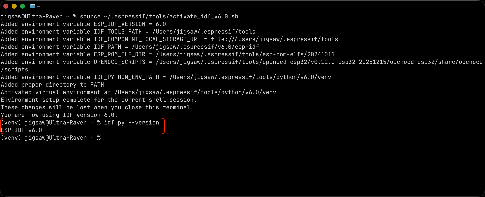
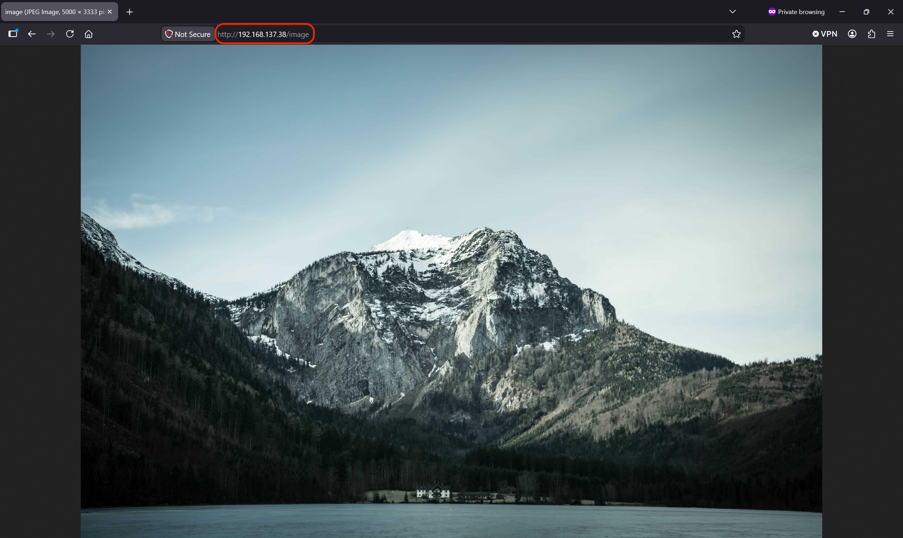

# esp32-w5500-driver
Custom W5500 SPI Ethernet driver for ESP32 with ESP-IDF esp_eth / esp_netif integration



## Wiring
| ESP32 | W5500 |
|---|---|
| 3V3 | VCC |
| GND | GND |
| GPIO23 | MOSI |
| GPIO22 | RESET / RSTn |
| GPIO21 | SCSn / CS |
| GPIO19 | MISO |
| GPIO18 | SCLK |
| GPIO4 | INTn |

## Instructions to Run The Demo

Make sure you have [ESP-IDF](https://docs.espressif.com/projects/idf-im-ui/en/latest/#linux-installation-via-homebrew) installed on your machine.
After installation, activate the dev environment with:

### Windows
On Windows, the installer creates a desktop icon labeled IDF_PowerShell. Clicking this icon will launch PowerShell with the environment set up, allowing you to start using ESP-IDF immediately. If you’ve installed multiple versions, you will have multiple icons, one for each version. [source](https://docs.espressif.com/projects/idf-im-ui/en/latest/after_installing.html)

### Linux & macOS
Run:
```cmd
source ~/.espressif/tools/activate_idf_[YOUR_VERSION].sh
```

If you are unsure about your version, run:
```cmd
cd ~/.espressif/tools/
ls
```

You should see the activation script here


You can check if the activation was successful with:
```cmd
idf.py --version
```



### Running The Demo
Clone the repo and change to the demo directory:
```cmd
git clone https://github.com/Teja-Tatimatla/esp32-w5500-driver.git
cd esp32-w5500-driver/examples/http_demo
```

Connect your ESP32 to your dev machine and connect an Ethernet cable to your W5500 module. Then run:
```cmd
idf.py set-target esp32
idf.py build flash monitor
```

You should see the following logs on success:
```txt
...
I (422) main_task: Started on CPU0
I (432) main_task: Calling app_main()
I (432) main: Starting W5500 Ethernet bring-up
I (432) w5500_spi: SPI initialized: host=2, clk=8000000 Hz, CS=21
I (432) w5500_driver: driver init complete
I (542) w5500_driver: hardware reset complete
I (542) w5500_driver: software reset complete
I (542) main: W5500 detected
I (542) demo: http demo initialized
I (542) esp_eth.netif.netif_glue: XX:XX:XX:XX:XX:XX
I (542) esp_eth.netif.netif_glue: ethernet attached to netif
I (552) main: Ethernet Started
I (552) main: Ethernet driver started; waiting for link/DHCP
I (562) main_task: Returned from app_main()
I (2552) w5500_phy: link transition: DOWN -> UP
I (2552) w5500_driver: Socket opened in MACRAW mode
I (2552) main: Ethernet Link Up
I (2552) main: Ethernet HW Addr XX:XX:XX:XX:XX:XX
I (5092) main: Ethernet Got IP Address
I (5092) main: ETHIP: 192.168.X.X
I (5092) demo_http: HTTP server started on port 80
I (5092) demo: http demo ready
I (5092) esp_netif_handlers: eth ip: 192.168.X.X, mask: 255.255.255.0, gw: 192.168.X.1
```

Then, on any system on the same subnet, visit:
```url
http://[esp32_ip]/status
```

The `/status` endpoint returns the following JSON:
```JSON
{
  "status": "ok",
  "ethernet": "up",
  "ip": "192.168.x.x",
  "driver": "W5500 in MACRAW mode",
  "last_update_seconds": 42,
  "bytes_transferred": 131
}
```

The http_demo example also provides `/image` endpoint that downloads and serves one of the following images at random:
```url
http://fastly.picsum.photos/id/29/4000/2670.jpg?hmac=rCbRAl24FzrSzwlR5tL-Aqzyu5tX_PA95VJtnUXegGU
http://fastly.picsum.photos/id/28/4928/3264.jpg?hmac=GnYF-RnBUg44PFfU5pcw_Qs0ReOyStdnZ8MtQWJqTfA
http://fastly.picsum.photos/id/237/3500/2095.jpg?hmac=y2n_cflHFKpQwLOL1SSCtVDqL8NmOnBzEW7LYKZ-z_o
http://fastly.picsum.photos/id/235/5000/3333.jpg?hmac=i9YaRj_AF62lGVYNlYhdL2gqRDxoUzypXLUXBj8ihCc
http://fastly.picsum.photos/id/350/5000/3338.jpg?hmac=Mi1x9fXFZlIsD8MQ3MpQsJmqZhF9vULz9qf6lmNnvUI
http://fastly.picsum.photos/id/556/5000/3333.jpg?hmac=3OTX-0AU9J26J1kYVIcJjDFGrAK5EMz-LRIu4zTzIsI
```



> Note that the images may load slower than actually visiting them on your browser.
> This is because instead of Browser -> Picsum CDN the demo has the following overhead:
> Browser -> ESP32 -> Picsum CDN -> ESP32 -> Browser
> Small 4096 byte buffer for image download
> SPI overhead:
> W5500 Ethernet PHY/MAC -> W5500 internal RX buffer -> SPI transfer -> ESP32 lwIP -> HTTP client/server code

# Special
## Instructions to set up code-intelligence on Zed code editor
If your editor uses `clangd` and cannot find ESP-IDF headers such as `esp_netif.h`, create a local `.clangd` file at the repository root and add:

```YAML
CompileFlags:
  CompilationDatabase: examples/http_demo/build

Diagnostics:
  Suppress:
    - unknown_typename
```

Then, run:
```cmd
cd examples/http_demo
idf.py build
```

 Change to the root of the project and create the following symlink:
 ```cmd
 ln -sf examples/http_demo/build/compile_commands.json compile_commands.json
 ```

 Finally, quit and reopen Zed.
