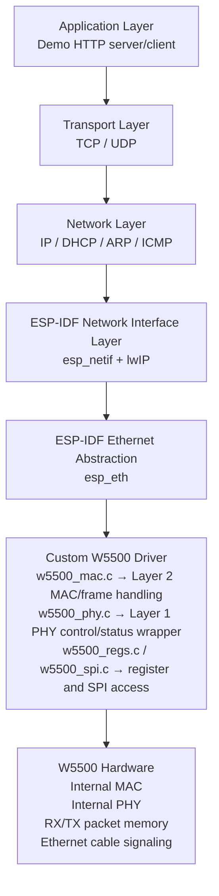

# esp32-w5500-driver
Custom W5500 SPI Ethernet driver for ESP32 with ESP-IDF `esp_eth` and `esp_netif` integration.


## Wiring

| ESP32 | W5500 |
|---|---|
| 3V3 | VCC |
| GND | GND |
| GPIO23 | MOSI |
| GPIO22 | RESET / RSTn |
| GPIO21 | SCSn / CS |
| GPIO19 | MISO |
| GPIO18 | SCLK |
| GPIO4 | INTn |

## Functional Requirements

### FR-01: Ethernet Interface Initialization

| ID | Requirement |
|---|---|
| FR-01.1 | The system shall initialize the Ethernet interface during startup. |
| FR-01.2 | The system shall report a failure status if the Ethernet controller is unavailable during startup. |
| FR-01.3 | The system shall report a failure status if the Ethernet controller is unresponsive during startup. |

### FR-02: Ethernet Event Detection

| ID | Requirement |
|---|---|
| FR-02.1 | The system shall detect Ethernet controller events. |
| FR-02.2 | The system shall notify the communication service logic when an Ethernet controller event occurs. |

### FR-03: Ethernet Frame Reception

| ID | Requirement |
|---|---|
| FR-03.1 | The system shall receive Ethernet frames from the Ethernet controller. |
| FR-03.2 | The system shall deliver each received Ethernet frame to the network stack for processing. |

### FR-04: Ethernet Frame Transmission

| ID | Requirement |
|---|---|
| FR-04.1 | The system shall accept outbound Ethernet frames from the network stack. |
| FR-04.2 | The system shall transmit outbound Ethernet frames through the Ethernet controller. |
| FR-04.3 | The system shall report a transmission result for each outbound Ethernet frame. |
| FR-04.4 | The transmission result shall indicate either success or timeout. |

### FR-05: IP-Based Network Communication

| ID | Requirement |
|---|---|
| FR-05.1 | The system shall support IP-based communication over the Ethernet interface. |
| FR-05.2 | The system shall support IP-based communication only after successful Ethernet interface initialization. |
| FR-05.3 | The system shall support IP-based communication only after successful network configuration. |

## Backend Functional Requirements

| ID | Requirement |
|---|---|
| FR-06 | The system shall start an HTTP server after successful Ethernet initialization and network configuration. |
| FR-07 | The system shall accept HTTP requests from a client device on the same network. |
| FR-08 | The system shall provide visualization data through at least one HTTP endpoint. |
| FR-09 | The system shall return the most recent available data in each HTTP response. |
| FR-10 | The system shall reject backend requests when the Ethernet interface or network configuration is unavailable. |


## Architecture Overview

This project exposes W5500 hardware to ESP-IDF as a custom Ethernet MAC/PHY driver.  
The W5500 is used in MACRAW mode, while ESP-IDF `esp_netif` and lwIP handle the higher-level networking stack.



## Architectural Trade-Off and Rationale

The W5500 includes a hardwired TCP/IP stack, an embedded 10/100 Ethernet MAC and PHY, hardware sockets, and internal packet buffer memory. Because of that, one possible design would be to use the W5500 as a socket-oriented network coprocessor and let the chip handle TCP/IP processing internally.

This project instead uses the W5500 as an Ethernet interface integrated with the ESP-IDF networking architecture. In this design, the W5500 provides Ethernet frame transmission/reception through SPI, while ESP-IDF `esp_eth`, `esp_netif`, and lwIP provide the standard network interface and TCP/IP stack integration.

Espressif’s W5500 component documentation notes that the W5500 includes a hardwired TCP/IP stack, but that this stack is **not used** by the ESP driver. Espressif’s Ethernet documentation also describes that, before attaching an Ethernet driver to the TCP/IP stack through `esp_netif`, the Ethernet driver is still operating at OSI Layer 2, the Data Link layer.

### Rationale for the Selected Architecture

The selected architecture allows the W5500 driver to integrate with ESP-IDF’s Ethernet framework and the normal `esp_eth` / `esp_netif` connection model. This makes the W5500 behave like a standard Ethernet network interface inside the ESP32 software environment, instead of behaving like a separate socket-processing subsystem.

### Alternative Rejected: Use the W5500 as a Socket-Based Coprocessor

**Advantage:**  
This approach could offload more TCP/IP processing from the ESP32 because the W5500 includes a hardwired TCP/IP stack and hardware socket support.

**Limitations:**

- Communication would be constrained to the W5500 hardware socket model.
- The W5500 supports a limited number of hardware sockets.
- Standard ESP-IDF networking services, such as the HTTP server/client, sockets API integration through lwIP, and normal `esp_netif` behavior, would require additional adaptation.

### Alternative Selected: Use the W5500 as an Ethernet Interface Under ESP-IDF

**Advantage:**  
This approach aligns with ESP-IDF’s Ethernet driver architecture and allows the W5500 to integrate with the platform’s standard networking stack and services.

**Result:**  
The custom driver handles the Ethernet MAC/PHY interface and raw Ethernet frame movement, while ESP-IDF `esp_netif` and lwIP handle DHCP, IP, TCP, UDP, sockets, and higher-level networking services.

### Layer Responsibilities

| Layer / Component | Responsibility |
|---|---|
| Application Layer | Demo HTTP server/client logic |
| Transport Layer | TCP and UDP, handled by lwIP |
| Network Layer | IP, DHCP, ARP, and ICMP, handled by lwIP |
| `esp_netif` | Connects lwIP to the Ethernet interface |
| `esp_eth` | ESP-IDF Ethernet driver abstraction |
| `w5500_mac.c` | Layer 2 Ethernet frame transmit/receive and MAC address handling |
| `w5500_phy.c` | Layer 1 PHY status/control wrapper for link, speed, duplex, and power |
| `w5500_regs.c` / `w5500_spi.c` | Low-level W5500 register and SPI access |
| W5500 Hardware | Internal MAC, internal PHY, RX/TX memory, and physical Ethernet signaling |

## Instructions to Run The Demo

Make sure you have [ESP-IDF](https://docs.espressif.com/projects/idf-im-ui/en/latest/#linux-installation-via-homebrew) installed on your machine.
After installation, activate the dev environment with:

### Windows
On Windows, the installer creates a desktop icon labeled IDF_PowerShell. Clicking this icon will launch PowerShell with the environment set up, allowing you to start using ESP-IDF immediately. If you’ve installed multiple versions, you will have multiple icons, one for each version. [source](https://docs.espressif.com/projects/idf-im-ui/en/latest/after_installing.html)

### Linux & macOS
Run:
```cmd
source ~/.espressif/tools/activate_idf_[YOUR_VERSION].sh
```

If you are unsure about your version, run:
```cmd
cd ~/.espressif/tools/
ls
```

You should see the activation script here


You can check if the activation was successful with:
```cmd
idf.py --version
```


### Running The Demo
Clone the repo and change to the demo directory:
```cmd
git clone https://github.com/Teja-Tatimatla/esp32-w5500-driver.git
cd esp32-w5500-driver/examples/http_demo
```

Connect your ESP32 to your dev machine and connect an Ethernet cable to your W5500 module. Then run:
```cmd
idf.py set-target esp32
idf.py build flash monitor
```

You should see the following logs on success:
```txt
...
I (422) main_task: Started on CPU0
I (432) main_task: Calling app_main()
I (432) main: Starting W5500 Ethernet bring-up
I (432) w5500_spi: SPI initialized: host=2, clk=8000000 Hz, CS=21
I (432) w5500_driver: driver init complete
I (542) w5500_driver: hardware reset complete
I (542) w5500_driver: software reset complete
I (542) main: W5500 detected
I (542) demo: http demo initialized
I (542) esp_eth.netif.netif_glue: XX:XX:XX:XX:XX:XX
I (542) esp_eth.netif.netif_glue: ethernet attached to netif
I (552) main: Ethernet Started
I (552) main: Ethernet driver started; waiting for link/DHCP
I (562) main_task: Returned from app_main()
I (2552) w5500_phy: link transition: DOWN -> UP
I (2552) w5500_driver: Socket opened in MACRAW mode
I (2552) main: Ethernet Link Up
I (2552) main: Ethernet HW Addr XX:XX:XX:XX:XX:XX
I (5092) main: Ethernet Got IP Address
I (5092) main: ETHIP: 192.168.X.X
I (5092) demo_http: HTTP server started on port 80
I (5092) demo: http demo ready
I (5092) esp_netif_handlers: eth ip: 192.168.X.X, mask: 255.255.255.0, gw: 192.168.X.1
```

Then, on any system on the same subnet, visit:
```url
http://[esp32_ip]/status
```

The `/status` endpoint returns the following JSON:
```JSON
{
  "status": "ok",
  "ethernet": "up",
  "ip": "192.168.x.x",
  "driver": "W5500 in MACRAW mode",
  "last_update_seconds": 42,
  "bytes_transferred": 131
}
```

The http_demo example also provides `/image` endpoint that downloads and serves one of the following images at random:
```url
http://fastly.picsum.photos/id/29/4000/2670.jpg?hmac=rCbRAl24FzrSzwlR5tL-Aqzyu5tX_PA95VJtnUXegGU
http://fastly.picsum.photos/id/28/4928/3264.jpg?hmac=GnYF-RnBUg44PFfU5pcw_Qs0ReOyStdnZ8MtQWJqTfA
http://fastly.picsum.photos/id/237/3500/2095.jpg?hmac=y2n_cflHFKpQwLOL1SSCtVDqL8NmOnBzEW7LYKZ-z_o
http://fastly.picsum.photos/id/235/5000/3333.jpg?hmac=i9YaRj_AF62lGVYNlYhdL2gqRDxoUzypXLUXBj8ihCc
http://fastly.picsum.photos/id/350/5000/3338.jpg?hmac=Mi1x9fXFZlIsD8MQ3MpQsJmqZhF9vULz9qf6lmNnvUI
http://fastly.picsum.photos/id/556/5000/3333.jpg?hmac=3OTX-0AU9J26J1kYVIcJjDFGrAK5EMz-LRIu4zTzIsI
```


> Note that the images may load slower than actually visiting them on your browser.<br>
> This is because instead of Browser -> Picsum CDN the demo has the following overhead:<br>
> Browser -> ESP32 -> Picsum CDN -> ESP32 -> Browser<br>
> Small 4096 byte buffer for image download
> SPI overhead:<br>
> W5500 Ethernet PHY/MAC -> W5500 internal RX buffer -> SPI transfer -> ESP32 lwIP -> HTTP client/server code<br>

# Special
## Instructions to set up code-intelligence on Zed code editor
If your editor uses `clangd` and cannot find ESP-IDF headers such as `esp_netif.h`, create a local `.clangd` file at the repository root and add:

```YAML
CompileFlags:
  CompilationDatabase: examples/http_demo/build

Diagnostics:
  Suppress:
    - unknown_typename
```

Then, run:
```cmd
cd examples/http_demo
idf.py build
```

 Change to the root of the project and create the following symlink:
 ```cmd
 ln -sf examples/http_demo/build/compile_commands.json compile_commands.json
 ```

 Finally, quit and reopen Zed.
